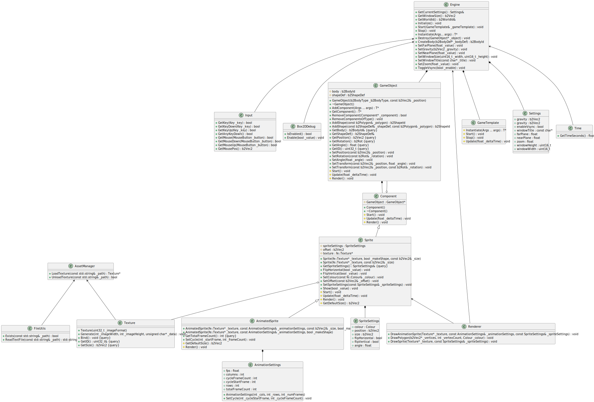

# FrogEngine

Find the template repository [here](https://github.com/Patrycioss/FrogEngineTemplate)
Find a demonstration of the engine [here](https://github.com/Patrycioss/PhysicsDemo)

A simple 2D game engine with [Box2D 3.0](https://github.com/erincatto/box2c) integration.

